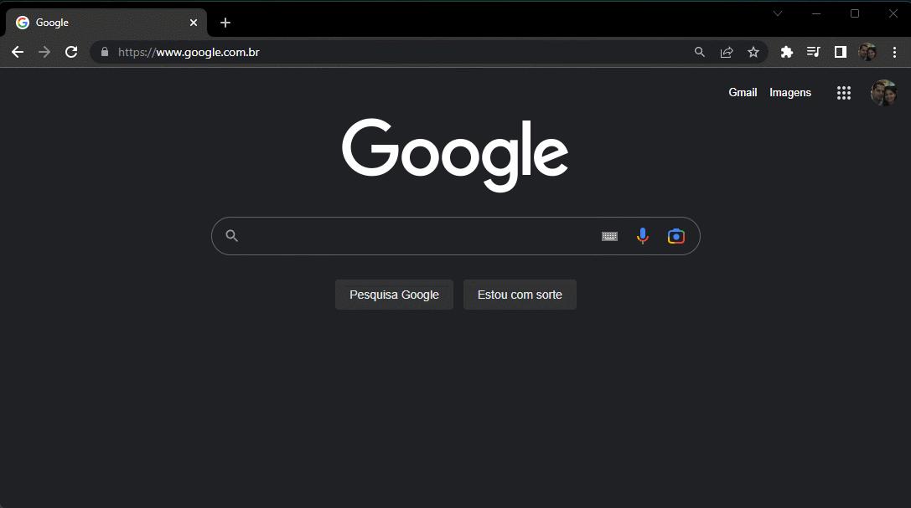

# Api-Url-Redirect

Este é um esboço de uma pequena API para redirecionamento de links.

O objetivo do cliente através dessa API é encurtar um determinado link de cadastro mas com possibilidade de alterná-lo com uma url padrão a cada 12 segundos.

Se a url informada não for encontrada na base de dados, será utilizada a url padrão.

##### Clone o repositório:
<code>git clone https://github.com/dannicleo/api-url-redirect.git</code>

##### Instale as dependências:
<code>npm install</code>

##### Rode a aplicação
<code>npm run dev</code>

##### Para testar acesse: 
http://localhost/cadastro/dannicleo

